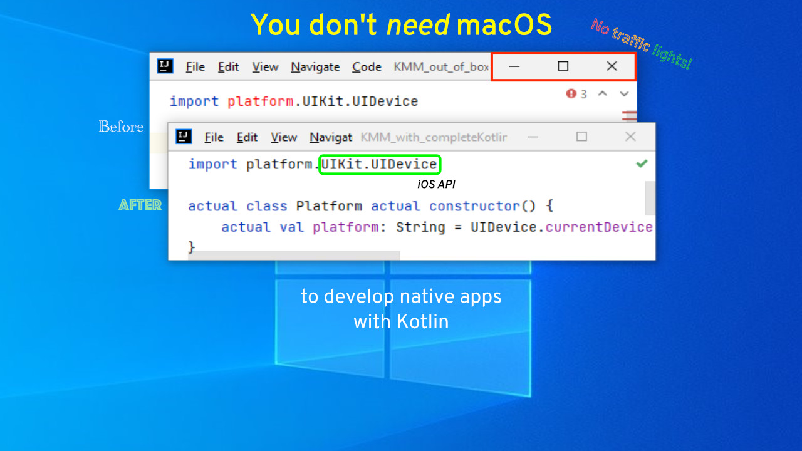

# CompleteKotlin

Gradle Plugin to enable auto-completion and symbol resolution for all Kotlin/Native platforms.

## What this plugin provides

This zero-configuration required Gradle plugin will allow you to comfortably write Kotlin code for all the supported
targets.

Before, you had only autocompletion and symbol resolution for native APIs from your host Operating System.
With CompleteKotlin, you get it for everything, regardless of your host OS:

Your host OS becomes irrelevant to writing and reading code: 

- That means writing and reading iOS, iPadOS, watchOS, tvOS, and macOS code, **without macOS**.
- That also means writing and reading Linux MIPS code, **without Linux**.
- Finally, that means writing and reading Windows code, **without Windows**.



Enjoy developing native mobile apps, native desktop apps, and maybe even embedded systems on MIPS.

CompleteKotlin doesn't care about [traffic lights](https://www.google.com/search?q=macos+traffic+lights),
[roadblocks](https://www.google.com/search?q=windows+defender), or even [penguins](https://www.google.com/search?q=tux),
it'll just see if any platform's definitions for Kotlin are missing and will make it… complete.

_It also doesn't care about droids because there's nothing incomplete there 😉._

## How to set up

Adding it to a Kotlin Multiplatform project is one copy/pasting, one button click,
and a bit, or a lot of waiting, depending on your connection and your computer performance:

### Step 1: Add the plugin

Take the `settings.gradle(.kts)` file located at the root of your Kotlin Multiplatform project,
and add the following at the top of the file, but below the `pluginManagement` block if you have any:

```kts
plugins {
    id("com.louiscad.complete-kotlin") version "1.0.0"
}
```

### Step 2: Click and wait

Then, make a Gradle sync/reload in the IDE with the best internet connection you have around, and once it's done,
that's it! You now have complete Kotlin!

### Step 3: Enjoy the exploration 👩🏿‍💻👩🏽‍💻👨🏾‍💻🧑🏼‍💻

Now, you can explore the APIs from whichever platform you want, without switching computers or VMs. 😎

**Important note:** CompleteKotlin enables API discovery (autocompletion and symbol resolution in the IDE),
but it **will not enable you to compile**, say a Windows app on a Mac, or an iOS app on Linux. Learn more in the FAQ below.

## The motivation behind this project

### Collaborating with non macOS users

I found out that I like doing pair-programming remotely with folks from anywhere on the planet on open source projects.
However, some projects involve platform exclusive APIs, which might mismatch with the person I want to pair with.

Same story for asynchronous collaboration. Having someone on Linux or Windows seeing red code in the IDE,
with unresolved references everywhere, just because it's using some Darwin or iOS APIs is not a good developer experience.

People might not use macOS for financial reasons, by choice, or because installing macOS on their machine is a bit hard,
or kinda illegal in some countries (but not in EU at least, you can do whatever with **your** hardware so long you're
not violating other laws, and that you're not selling said hardware loaded with restricted intellectual property).

I believe these reasons should not prevent people from collaborating. Diversity often leads to better results for an
ever diverse world, and everyone on almost the exact same computer doesn't sound like diversity.

### World economics, talent spread and mobile platform local markets

When your rent is less than 3% of what it'd be in San Francisco, you don't start a project or startup by buying Macs for all the developers.
Young folks in these parts of the world are no less smart than other ones, so why limit ourselves?

The most profitable markets have a share of iOS users that can rarely be ignored.
I thought it'd be great that people get similar opportunities with similar effort, regardless of their local economy,
so I hope this is helping and will make a positive, long-lasting impact.

### Kotlin/Everywhere, because it's good stuff

Kotlin might not be perfect, but it's most likely the best designed and run high-level programming language IMHO, and it can be fun in a good way. It makes it easier to avoid bugs, including concurrency issues, so it makes sense to promote leveraging it across platforms, for the benefit of developers and their end users, humans, cats, dogs, monkeys, you name it.

### Curiosity of what YOU will do with it 

Feel free to tell your stories enabled by this project in GitHub discussions, or to tell me about them on Twitter DM, Kotlin's Slack or email, I'll be happy to know about it! 😊

## Who made this

The code: Louis CAD, pair-programming with Waqas Ahmed, remotely, using pop.com

## Credits

Pair-programming:
- [Waqas Ahmed](https://github.com/waah42), Germany

Pre-release testing, and screenshots:
- [Rachid Insa](https://github.com/theshid), Ghana (Windows 10, 8GB of RAM, 5400rpm HDD 😬, xMbps connection 😬)
- [Jean-Michel Fayard](https://github.com/jmfayard), France (Chrome OS \[Debian\], 4GB of RAM 😬)
- [Romain Bouchaud](https://github.com/RomainBouchaud), France (Windows 10)

## Do you love it?

We hope you do!

If you want to support this project, and future Kotlin related projects from Louis CAD and friends, here are 3 things you can do:
1. Star this project 🙏
2. Say thanks [on Twitter](https://twitter.com/Louis_CAD) and spread the word 😊📢
3. Get your company, or yourself, to [help me get past 50 monthly sponsors](https://github.com/sponsors/LouisCAD) ❤️💜 

## FAQ

### Where does it work?

- Linux x64 (arm64 not tested yet, might not work, please open an issue if you use it)
- Windows x64
- macOS

### How to create a KMM project without the macOS exclusive KMM plugin?

With IntelliJ IDEA (including the Community Edition), you can create a Kotlin Mobile app or library project.

You can later on open it in Android Studio, to get the latest and greatest on the Android side, while still sharing code and writing iOS specific code comfortably.

### How to compile my app, if CompleteKotlin cannot help for that?

You need use the required host OS for compilation when you need to compile, but you don't need it when writing the code.

That required OS can run in a VM (Virtual Machine), on a shared machine of your team or from a **trustworthy** friend, or on machine in "the cloud", be it a CI (Continuous Integration) service, or an infrastructure service.

_If you had a particularly great experience with a CI service for native apps developers, feel free to let me know and tell me how your experience was great. I'll consider adding the name here._

### How reliable is CompleteKotlin?

We're quite confident about its reliability.

We tested it on multiple 1.4 and 1.5 Kotlin releases and pre-releases, but had to give up exhaustiveness to save time, bandwidth.
So far, we tested it on macOS, Windows and Chrome OS (essentially Linux), with zero issue, apart that some people tolerate very slow computers! Well, I used to do as well…

### Could a Kotlin release break this plugin?

Almost guaranteed to never happen.

Kotlin is developed in the open, and folks at JetBrains that maintain and improve Kotlin would not want to make Kotlin less complete!

If there's any change arriving into Kotlin that would affect this plugin, or that, who knows,
would enable CompleteKotlin to be even more complete, if it's possible, I'm going to be aware, and I'll address it and release a new version, most likely ahead of time, so you should never have to choose between upgrading Kotlin and keeping Kotlin complete.

### I've seen you are pair-programming with folks from the community, can I join?

Yes, just reach out via Twitter DM, Kotlin Slack or something, we'll work it out.

### License of the project?

MIT

No usage restrictions or liabilities, but please, be a responsible and nice human being, even when thinking and writing code 😉

#### What about exclusivity to things?

Unless it's designed to avoid true abuse, it's often a bad idea, at least, bad outcomes overall IMHO.

#### Do you like macOS?

Yes

#### Do you like Chrome OS?

Yes

#### Do you like Linux?

Yes

#### Do you like Windows?

Hum… yes. Also, WSL2 is quite cool for developers IMHO.

#### Do you like Fuchsia?

🔮 looks like I might…

###### Do you like Apple?

Depends. I like kiwis and pears too to name a few.

#### Is that all?

Yes, I think the FAQ is quite complete now. 🥁

However, if there's any question you want to see here, feel free to ask in the GitHub Discussions of this project.
